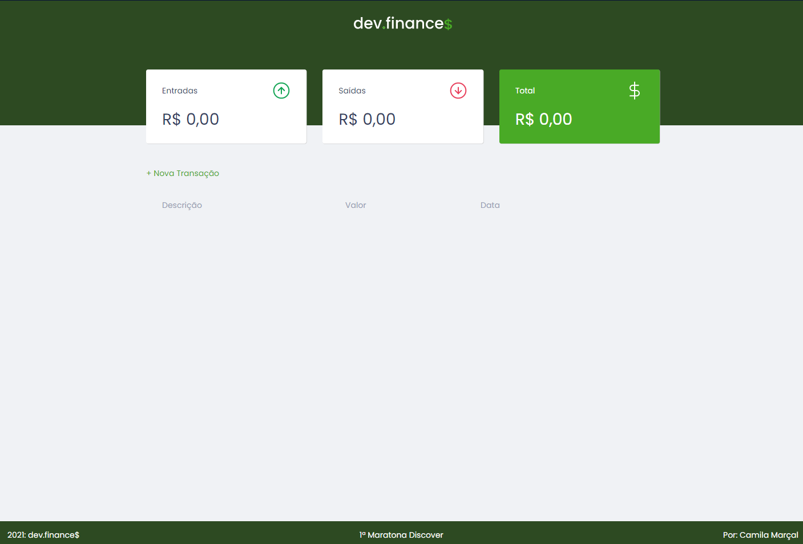

  

 

  

## :hammer_and_pick: Technologies

This project was developed using the following technologies:

- HTML
- CSS
- JavaScript

## Project

dev.finances is a financial control application, where you can add and delete transactions, view the incoming and outgoing balance, as well as the total balance between them. 

## Information

This project was developed during the 1st Rocketseat Discover Marathon. 

## :heavy_check_mark: Additional Features

- [x] The card with the total value changes color according to the positive or negative balance. 
- [x] Edit transaction button.

Made by: Camila Marçal
